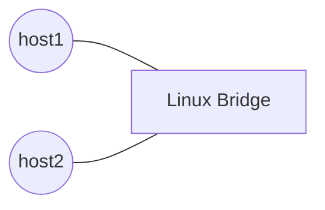

# LAB 000
Intended to try out L2 traffic between two hosts connected via a Linux bridge.

## Questions
### 1. What happens when routing table entry for subnet is no longer available in `ip route show`?
**Expected:**
**Outcome:** 

### 2. If host1 has no routing table entry for subnet, can host2 ping host1 even if host2 has the subnet in the routing table?
**Expected:**
**Outcome:** 

### 3. Added a host3 to the same bridge, within a different subnet, is it able to reach host1 or host2?
**Expected:**
**Outcome:** 

## Topology
Simple **switch (L2)** connection between two hosts:

## How-To
Set up a Linux bridge and connect multiple network namespaces to it. Assign IP addresses and observe ARP and ICMP behavior across L2.
