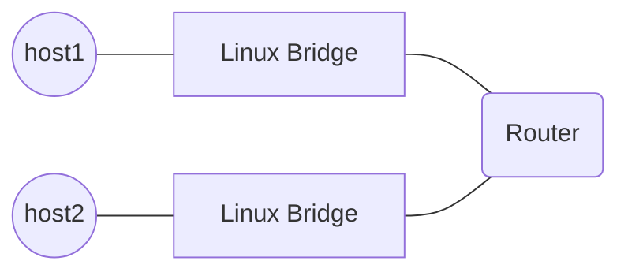

# LAB 001
Explores L3 routing using namespaces

## Questions
### 1. What happens when hosts are on different subnets?
**Expected:** Each host should send packets to their router and the router should havea FIB containing both subnets.
**Outcome:** As expected.

### 2. What if we remove `host1` default route?
**Expected:** This should fail. But dump proves routing starts on host.
**Outcome:** As expected.

### 3. What if we disable forwarding on router?
**Expected:** Packets reach router but never gets out of it.
**Outcome:** As expected.

## Topology
Two L2 domains connected by a Linux router.

## How-To
Set up a Linux bridge for as many namespaces and connect them with a L3 configured namespace.
